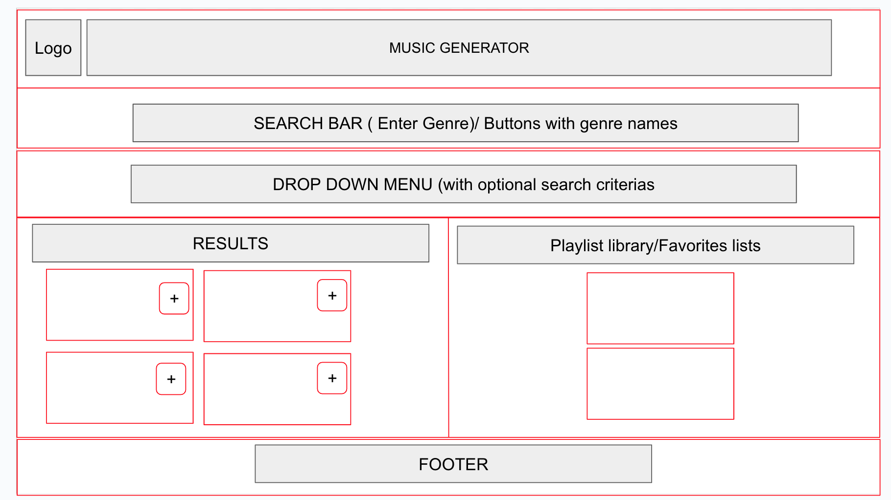
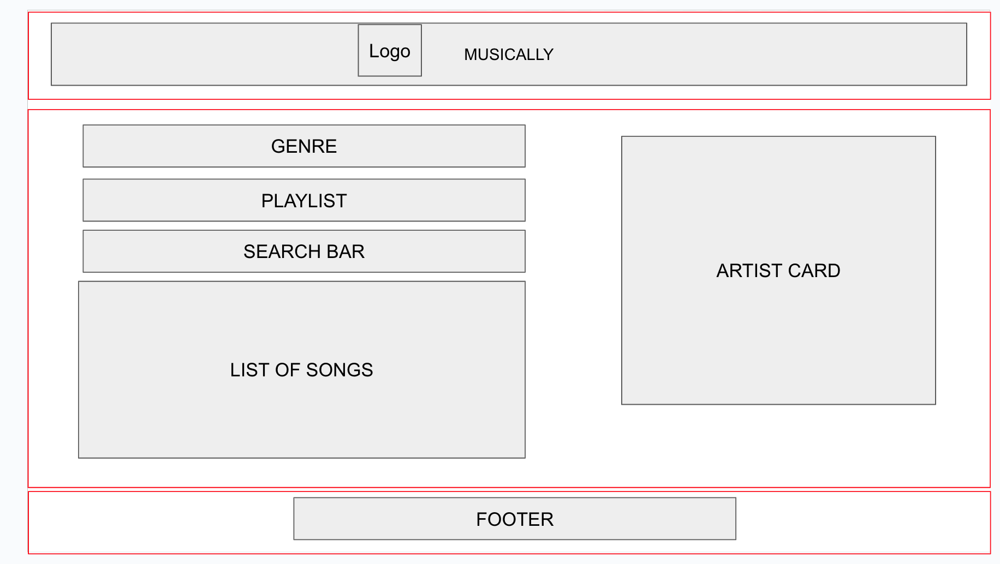
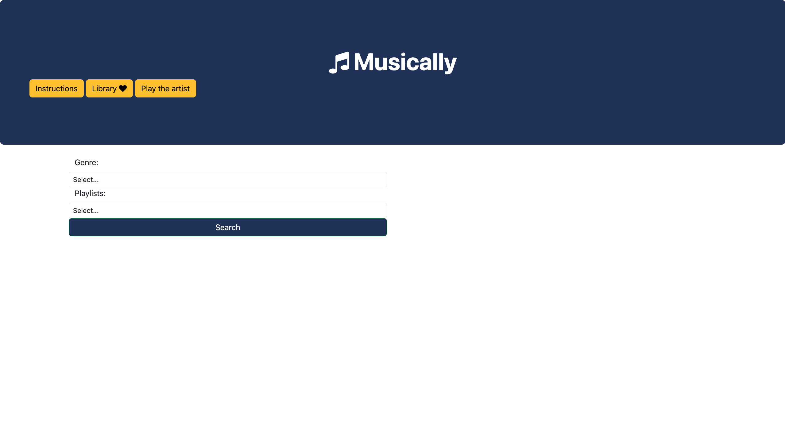
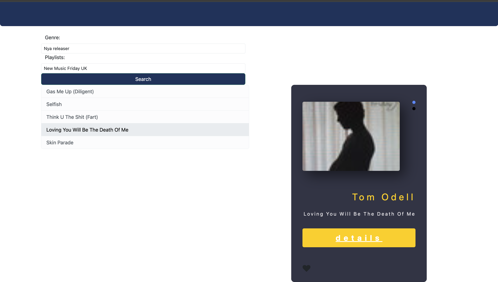
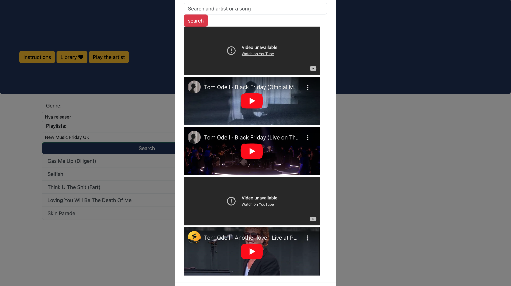
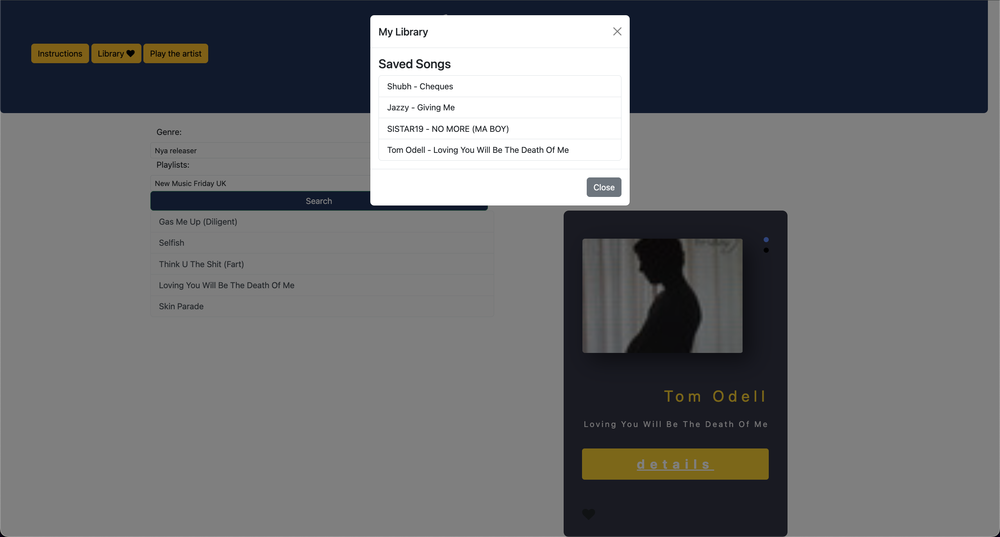

# Musically
 A web application that allows users to find music based on different genres!

## Task
---
With your team, you'll conceive and execute a design that solves a real-world problem by integrating data received from multiple server-side API requests. You will also continue to learn about agile development methodologies to help you work collaboratively. You will implement feature and bug fixes using git branch workflow and pull requests.
You will write your own user stories and acceptance criteria in GitHub Issues to help your team stay on track with the project. Using GitHub Project as a means to track the status of your project tasks will help you understand the benefits of Kanban boards.

## Collaborators
---
<ol>
<li> <a href='https://github.com/Sooey-99'> Émile Siou - Github Profile </a>
<li> <a href='https://github.com/jakewshenry'> Jake Henry - Github Profile </a>
<li> <a href='https://github.com/ReginaAbena19'> Regina Osei-Bonsu - Github Profile </a>
</ol>

## Task Objectives / Requirements 
----
<li>
Speak technically about a feature you implemented in your project
<li>
Explain and execute git branching workflow in a collaborative project
<li>
Resolve merge conflicts
<li>
Explain agile software development
<li>
Design, build, and deploy a client-side web application using GitHub Pages
<li>
Prepare a professional presentation and repository README for your project
 
 

## Tech Stack / Technologies 
----
The following tools are to be used in this project:
<ol>
<li> HTML, CSS and Bootstrap
<li> 2 Server Side API's
<li> Javascript / Jquery
<li> Responsive design
<li> Client-side storage
</ol>

## Project Description
---
Musically is a  web application that helps users find artists/ songs from different Genres.

The main motivation behind Musically is to promote further cross-cultural musical explorations.

The project was built to address the common challenge of never knowing what music comes from which genre and to help people better interact with others and explore new music and saving songs and tracks to their library.  

It aims to solve the issue of lack of diversity within the music scene. 

During the development of this project, valuable insights into API integration and user experience design were gained. Moreover, the ability to handle asynchronous requests and data manipulation were further improved on.

## Method
----
Musically a single page web-application. Users who user the application get to choose the Genre and Playlist they are excited about exploring. They are then given a list of songs to explore further. If they are interested they can search for the song/artist using the Play Artist modal which connects them to youtube. They also have an ability to save the songs that interest them the most to a favorites library to explore further later.
 
 
Below is our approach to this task:
<ol>
<li> Planning and Setup was then executed using a Kanban style via Trello.
<li> We worked collaboratively to establish the user stories for our web applications.
<li> Everyone was then assigned an indidivual task 
<li> We mostly worked together on the UI and API Integration
<li> Documentation and Debrief
</ol>

## Conclusion
---
Overall, we as a group felt we were put to our paces for this challenge in all aspects from styling to API integration to Dom manipulation. Nevertheless, we believe that our proactivity in reading the documentation and researching how to do thing when we were unsure is what has helped us finish our project off. 

## Future Improvements
Can be found in the presentation here: https://docs.google.com/presentation/d/1sYHsHQNAzi_sKaM_fIkCoZdmaHoeDPLs-bcWbdCg6H0/edit#slide=id.gcb9a0b074_1_0

## Application Preview
---

## Installation
---
Repo can be accessed here:

https://github.com/ReginaAbena19/Musically 

Deployed site can be accessed here:
https://reginaabena19.github.io/Musically/

To run musically locally, follow these steps:

Fork the repository to your local machine.
Run live server from index.html

API KEYS:
The application cannot be successfully run without them so please ensure you have the 
necessary authorisation.

- Spotify - ClientId and ClientSecret
- Youtube API - Apikeys

## Usage
---
- Select a Genre you would like to Explore
- Select a playlist from said Genre
- Explore the displayed songs from both the Genre & Playlist 
- Search and play the song/ video from the displayed songs 
- Save your favorites to a library recipes using the "Add to Favorites" button

## Credit/Resources
Spotify Web API - https://developer.spotify.com/documentation/web-api
Youtube API - https://developers.google.com/youtube/v3

Javascript: 
https://developer.mozilla.org/en-US/docs/Web/JavaScript/Guide/Expressions_and_Operators
https://developer.mozilla.org/en-US/docs/Web/JavaScript/Reference/Statements/for
https://developer.mozilla.org/en-US/docs/Web/API/Window/localStorage

CSS:
Cards - https://www.youtube.com/watch?v=LBAThoUn3rU&amp;ab_channel=Mathe.%7CCreativeCodingCamp

## Licenses
---
This project is licensed under the MIT License.

